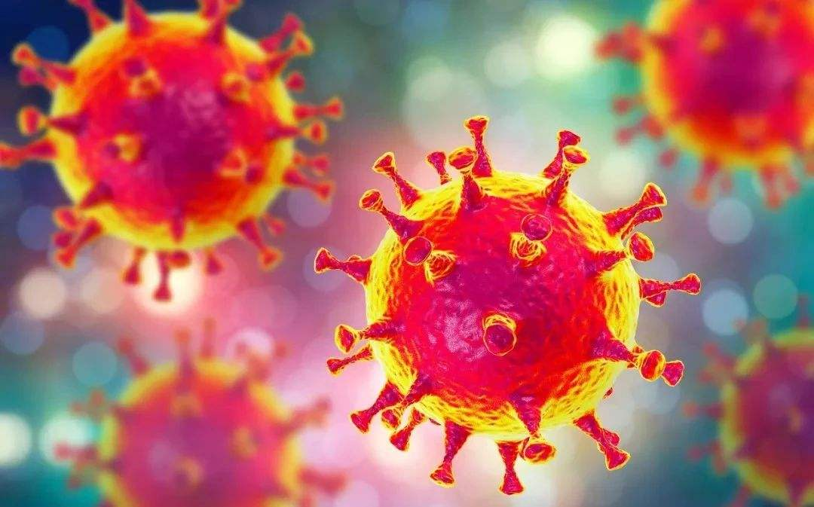

新年马上就要过去了，当然是指农历鼠年的2020年。
与2003年十分仿佛的一年。
没有想到的是这次的肺炎疫情从感染数量上已经超越了2003年的SARS。
人类在大自然面前依然是脆弱的。

人类的寿命延长，与其说是因为医疗条件的日新月异，
我个人情愿说，归根结底的缘由，只有一个：人造环境搭建的逐渐完善。
我们人类已经脱离大自然相当一段时间了，
尽管这个相当的时间说起来也并不算很长，尤其现代医学与城市化的不断发展，
其实就是脱离大自然，建立人造环境的过程。

因此人类基本上已经只能生存在人造环境，最具有代表性的，就是城市。
城市让人类远离大自然，与自然生物的关系趋近于零。
无论是非典SARS还是这次的冠状病毒肺炎，都源自于蝙蝠这一自然生物，
蝙蝠是极其古老的，唯一可以飞行的哺乳动物，从它身上将病毒散布，可以说是颇为“合情合理”的。

第一次SARS病毒，因为自然环境进入到夏季而自然消亡，那么这次究竟如何，怕是也离不开自然。
破解之法，不妨引用一句民谚：解铃还须系铃人。
既然这“铃”是野生环境，自然环境之中的蝙蝠而来，那么破解之道，应当也在蝙蝠。

2003年非典之后，在蝙蝠这方面应当是无甚进展的，
2020年肺炎之后呢？
希望可以在蝙蝠这里有所突破。
因为，也许再下一次，病毒将会更具备潜伏期和隐形传染。

人类到底能从历史中汲取多少教训？
